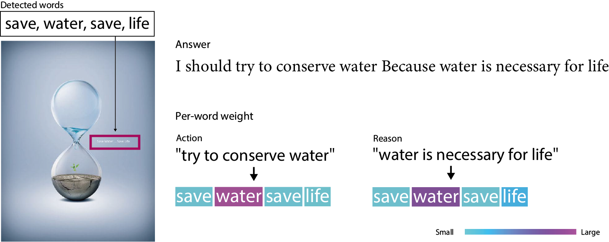

Implementation of our approach for [Automatic Understanding of Visual Advertisements Challenge](https://evalai.cloudcv.org/web/challenges/challenge-page/86/overview) (1st place of 2018 challenge).

<p align="center"></p>

# Requirements


You need to have following packages:

- chainer
- keras
- cupy
- gensim
- nltk
- pandas
- pytables

We also provide a Dockerfile to setup dependencies.

We use Google word2vec to compute word embeddings. Download GoogleNews-vectors-negative300.bin.gz [here](https://code.google.com/archive/p/word2vec/) and set `WORD2VEC_PATH`.

```
export WORD2VEC_PATH=/path/to/Word2Vec/GoogleNews-vectors-negative300.bin
```

# Data

You can get the competition dataset [here](https://evalai.cloudcv.org/web/challenges/challenge-page/86/overview).
Downlaod the training/test datasets and extracut them in the `data` directory.

We also use OCR results. Download the OCR results ([figshare](https://figshare.com/projects/_Advertisement_VQA_Challenge_cyberagent_model_and_data/35579)) and save in the `data` directory.


# Preparation

Before training, pre-compute Faster-RCNN features of ad images.

```
VA_DATASET_ROOT=/path/to/VisualAdvertisementDataset/ python script/save_feat.py
```

Otherwise, you can download precomputed Faster-RCNN features ([figshare](https://figshare.com/projects/_Advertisement_VQA_Challenge_cyberagent_model_and_data/35579)), and copy to `data/frcnn_feat/`.

# Training

To train our full model, run

```
python script/train.py --model_name ocr+vis --text_net cnn
```

An output directory will be made under `/output/checkpoint/`, and a trained model and some other output files will be saved in the directory.

# Evaluation

To evaluate a model, run

```
python script/train.py --eval /path/to/output/directory
```

# Reproduce the competition results

Download two figshare items `Chainer model file` and `tokenizer and word embeddings` ([figshare](https://figshare.com/projects/_Advertisement_VQA_Challenge_cyberagent_model_and_data/35579)).
Copy `wordvec.npy` and `tokenizer.pickle` to `data` directory, then run

```
python script/train.py --eval /path/to/directory/of/Chainer_model_file
```

# Visualizing the results

We included some code snippets for visualization. See `notebook/visualize inference.ipynb`.